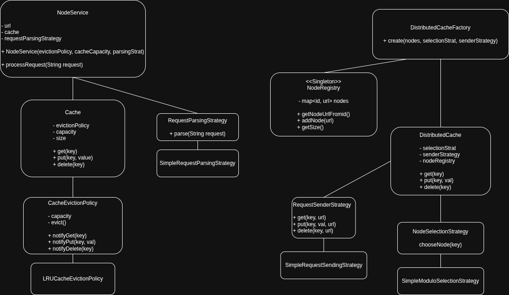

# Distributed Cache - Design Explanation



## Table of Contents
- [Data Distribution](#data-distribution-across-nodes)
- [Cache Miss Handling](#cache-miss-handling)
- [Eviction Policy](#eviction-policy)
- [Extensibility](#extensibility)

---

## Data Distribution Across Nodes

### Node Selection Strategy
A `NodeSelectionStrategy` determines which node owns a given key. The current implementation (`SimpleModuloSelectionStrategy`) works as follows:
- Computes the ASCII sum of the key
- Takes `mod N` (where N = number of nodes) to pick a node index
- **Guarantee:** The same key always maps to the same node

### Node Registry
The `NodeRegistry` (singleton pattern) maintains the mapping from node IDs to their URLs:
- All node URLs are registered at startup
- Each node is assigned a sequential integer ID

### Request Flow
```
put("name", "Kartavya")
  ↓
NodeSelectionStrategy.chooseNode("name") → returns node URL
  ↓
RequestSenderStrategy.put(...) → sends request to node
  ↓
NodeService → local Cache stores the value
```

---

## Cache Miss Handling

**Current behavior:** Explicit cache miss handling is not implemented.

When a `get` is called for a missing or evicted key:
- The node's `Cache` returns `null` from its internal `HashMap`
- No fallback to a backing store or other nodes occurs
- The caller receives `null`

---

## Eviction Policy

Each node maintains a local `Cache` paired with a `CacheEvictionPolicy`. The LRU (Least Recently Used) implementation works as follows:

### Data Structure
- `DoublyLinkedList` tracks access order: head = most recent, tail = least recent
- Direct reference to the cache's `HashMap` allows in-place eviction

### Operations

| Operation | Behavior |
|---|---|
| **get** | Move key to head of list |
| **put (new key)** | If at capacity, evict tail (LRU), remove from `HashMap`, insert new key at head |
| **put (existing key)** | Move key to head; no eviction |
| **delete** | Remove key from linked list |

---

## Extensibility

The design uses the **Strategy pattern** across four abstractions, enabling new behavior through subclassing without modifying existing code:

| Abstraction | Current Implementation | Alternative Strategies |
|---|---|---|
| `NodeSelectionStrategy` | `SimpleModuloSelectionStrategy` | Consistent hashing, weighted routing |
| `RequestSenderStrategy` | `SimpleRequestSendingStrategy` | HTTP client, gRPC, async sender |
| `CacheEvictionPolicy` | `LRUCacheEvictionPolicy` | LFU, FIFO, TTL-based eviction |
| `RequestParsingStrategy` | `SimpleRequestParsingStrategy` | JSON parser, binary protocol |

The `DistributedCacheFactory` acts as a central configuration point, wiring these strategies together at construction time.
