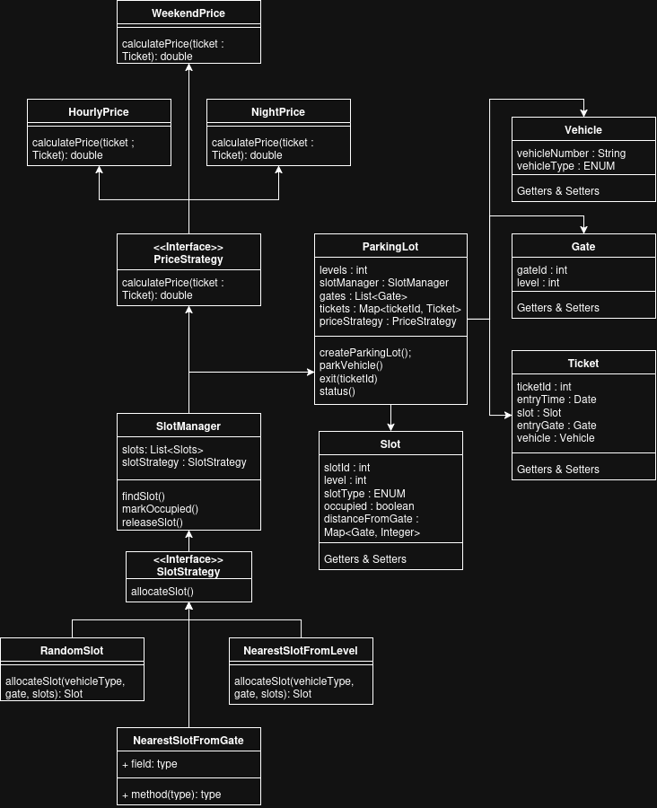

# Parking Lot Design (LLD)

This project models a parking lot system using object-oriented design and strategy patterns.

## UML Diagram

## What This Design Contains

The UML shows 4 main parts:

1. Core domain objects
2. Slot allocation strategy
3. Pricing strategy
4. Orchestration through `ParkingLot`

## Class-by-Class Explanation

### `ParkingLot`

This is the main orchestrator.

- Holds `levels`, `gates`, active `tickets`
- Uses `SlotManager` to allocate/release slots
- Uses `PriceStrategy` to calculate exit amount
- Main operations:
	- `parkVehicle(vehicle, gate)`
	- `exit(ticketId)`
	- `slotStatus(slots)`

### `SlotManager`

Responsible for slot operations.

- Owns all `Slot` objects
- Delegates slot selection to `SlotStrategy`
- Releases slot on exit

### `SlotStrategy` (Interface)

Defines how a slot is selected:

- `allocateSlot(vehicleType, gate, slots)`

Concrete strategies shown in UML:

- `NearestSlotFromLevel` (implemented in code)
- `RandomSlot` (shown in UML as an alternative)
- `NearestSlotFromGate` (shown in UML as an alternative)

### `PriceStrategy` (Interface)

Defines how parking price is calculated:

- `calculatePrice(ticket)`

Concrete strategies:

- `HourlyPrice`
- `NightPrice`
- `WeekendPrice`

### `Slot`

Represents one parking slot.

- `slotId`, `level`, `slotType`, `occupied`
- `distanceFromGate: Map<Gate, Integer>` to support nearest-slot logic

### `Ticket`

Represents one active parking session.

- `ticketId`, `entryTime`, `slot`, `vehicle`
- Created at entry and removed on exit

### `Vehicle`

Represents incoming vehicle.

- `vehicleNumber`
- `vehicleType` (`TWO_WHEELER`, `CARS`, `BUSES`)

### `Gate`

Represents entry/exit gate context.

- `gateId`
- `level`

## Flow

### 1. Park Vehicle

1. Client calls `ParkingLot.parkVehicle(vehicle, gate)`.
2. `ParkingLot` asks `SlotManager.findSlot(vehicleType, gate)`.
3. `SlotManager` delegates to `SlotStrategy.allocateSlot(...)`.
4. Strategy returns the best available `Slot`.
5. `ParkingLot` creates a `Ticket`, marks slot occupied, stores ticket in active map.

### 2. Exit Vehicle

1. Client calls `ParkingLot.exit(ticketId)`.
2. `ParkingLot` fetches `Ticket`.
3. `PriceStrategy.calculatePrice(ticket)` returns charge.
4. `SlotManager.releaseSlot(ticket.slot)` marks slot free.
5. Ticket is removed from active map and amount is returned.

## Why Strategy Pattern Here

- Slot selection can change without changing `ParkingLot`
- Price calculation can change without changing `ParkingLot`
- New strategies can be plugged in easily

This keeps the design open for extension and easy to test.
