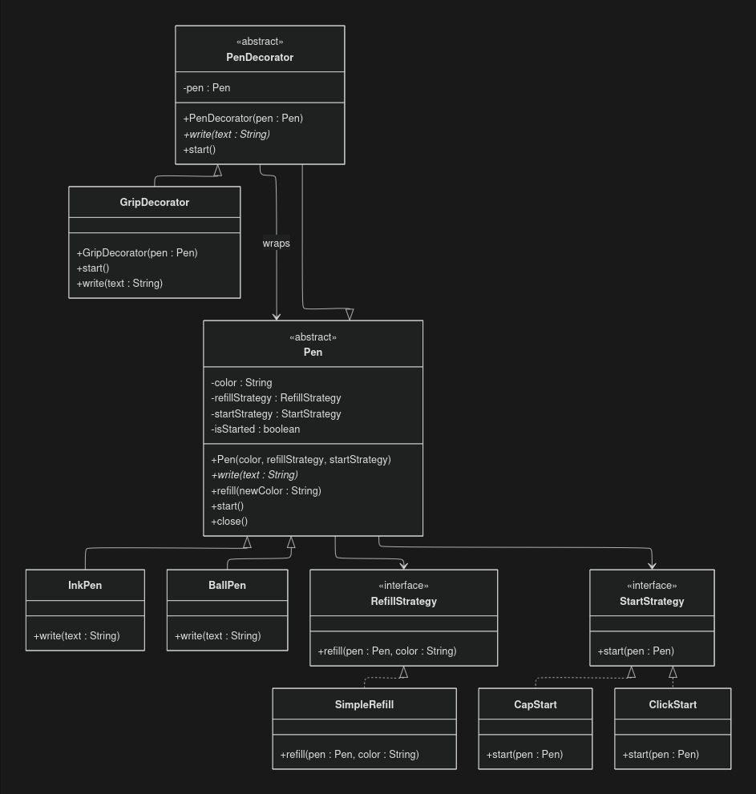

# Pen Design (Strategy + Factory + Decorator-ready)

## UML Diagram

## What This Design Shows

This design models a pen system using:

- Inheritance for pen types (`Pen` -> `InkPen`, `BallPen`)
- Strategy Pattern for variable behaviors:
  - Start behavior (`StartStrategy` -> `CapStart`, `ClickStart`)
  - Refill behavior (`RefillStrategy` -> `SimpleRefill`)
- Factory Pattern for object creation (`PenFactory`)
- Decorator extension point in UML (`PenDecorator`, `GripDecorator`) to wrap a pen without changing the base class

## UML Elements Explained

### 1. `Pen` (abstract)

Holds:
- `color`
- `refillStrategy`
- `startStrategy`
- `isStarted`

Defines:
- `write(text)` (abstract, implemented by concrete pens)
- `start()` (delegates to `startStrategy`)
- `refill(newColor)` (delegates to `refillStrategy`)
- `close()` (marks pen as closed)

### 2. Concrete pens: `InkPen`, `BallPen`
Both extend `Pen` and implement `write(text)`.

Behavior:
- If pen is not started, they throw an error.
- If started, they print writing output.

### 3. `StartStrategy` (interface)
Defines how a pen starts:
- `start(pen)`

Implementations:
- `CapStart`: simulates removing a cap.
- `ClickStart`: simulates clicking the pen.

### 4. `RefillStrategy` (interface)
Defines how refill is done:
- `refill(pen, color)`

Implementation:
- `SimpleRefill`: updates pen color and prints refill message.

### 5. `PenFactory`
Creates a pen based on input:
- Pen type: `ink-pen` or `ball-pen`
- Color
- Mechanism: `with-cap` or click-based

Factory internally wires concrete strategy objects and returns the correct pen object.

### 6. Decorator in the UML (`PenDecorator`, `GripDecorator`)
The diagram also shows a decorator layer where:
- `PenDecorator` wraps a `Pen`
- `GripDecorator` extends `PenDecorator`

Purpose:
- Add extra behavior (for example comfort grip logic) dynamically without modifying `InkPen` or `BallPen`.

Note:
- These decorator classes are shown in UML but are not currently present in this codebase.

## Flow 

`Application.main()` follows this flow:

1. Ask `PenFactory` for a pen.
2. `PenFactory` chooses:
   - refill strategy (`SimpleRefill`)
   - start strategy (`CapStart` or `ClickStart`)
   - concrete pen (`InkPen` or `BallPen`)
3. App calls `pen.start()`.
   - `Pen` delegates to selected `StartStrategy`.
   - `isStarted` becomes true.
4. App calls `pen.write("Hello World")`.
   - Concrete pen writes only if started.
5. App calls `pen.close()`.
   - `isStarted` becomes false.
6. App calls `pen.refill("black")`.
   - `Pen` delegates to `RefillStrategy`.
   - Color gets updated.

## Why This Design Is Useful

- Easy to add new pen types (`GelPen`, etc.) via inheritance.
- Easy to add new start/refill behaviors without changing existing pen classes.
- Factory keeps object creation centralized.
- UML already prepares for decorator-based runtime feature additions.
