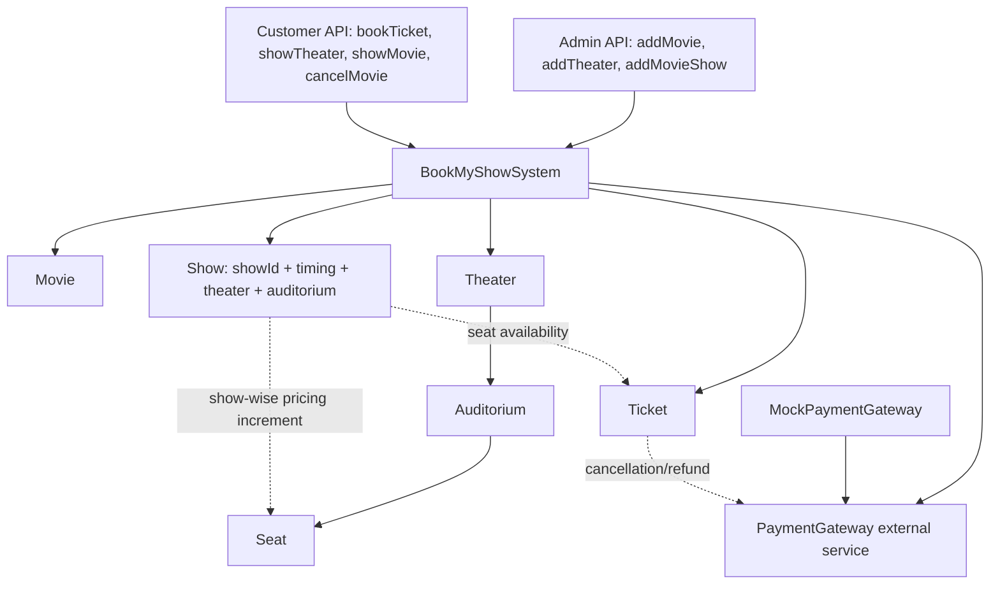
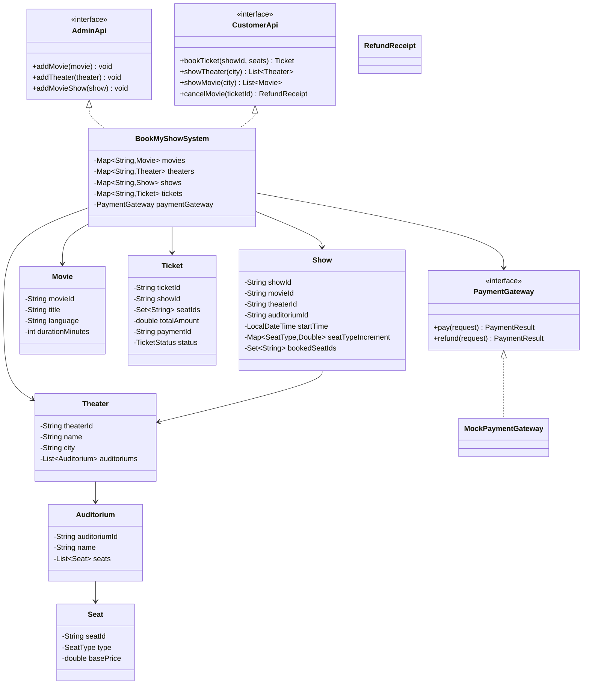

# Book My Show LLD Demo

This module implements a movie ticket booking system with separate admin/customer APIs, dynamic pricing per show and seat, external payment integration, and cancellation with refund.

## UML Diagram (Schema View)



## Class Diagram (Code-Level)



## APIs Covered

### Customer

- `bookTicket(showId, seats)`
- `showTheater(city)`
- `showMovie(city)`
- `cancelMovie(ticketId)`

### Admin

- `addMovie(movie)`
- `addTheater(theater)`
- `addMovieShow(show)`

## Requirement Coverage

- Two user roles are represented as separate APIs (`CustomerApi`, `AdminApi`).
- A show links movie, theater, auditorium, and timing.
- Theater has multiple auditoriums, and each auditorium has its own seats.
- Booking flow supports selecting show and seats, then calculates total payable amount.
- Pricing is dynamic:
  - seat base price from `Seat`
  - plus show-specific increment by seat type from `Show`
- Payment/refund goes through an external gateway abstraction (`PaymentGateway`).
- Cancellation API releases booked seats and processes refund.

## Build & Run

From project root (`book-my-show`):

```bash
javac src/com/example/bookmyshow/*.java
java -cp src com.example.bookmyshow.App
```

## Demo Notes

`App` demonstrates:

- admin onboarding of movie/theater/show
- customer discovery APIs (`showTheater`, `showMovie`)
- booking seats with dynamic pricing
- cancellation with refund
