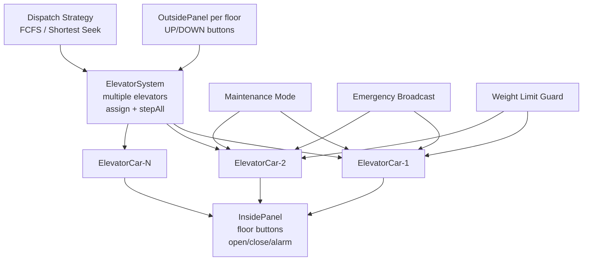
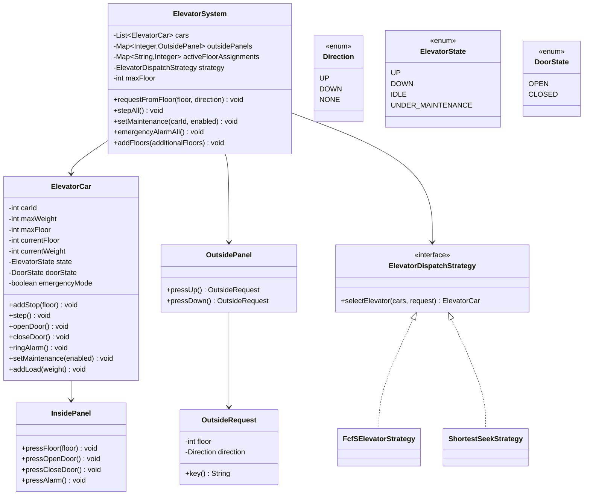

# Elevator LLD Demo

This module implements a multi-elevator system with outside/inside panels, dispatch strategy selection, maintenance mode, emergency broadcast, dynamic floor extension, and weight safety checks.

## UML Diagram (Schema View)



## Class Diagram (Code-Level)



## Requirements Coverage

- Multi-elevator support via `ElevatorSystem` with `List<ElevatorCar>`.
- Single outside panel per floor implemented as `OutsidePanel` map (`floor -> panel`).
- Inside panel per elevator with floor/open/close/alarm actions.
- Dispatch strategy pattern implemented:
  - `FcfSElevatorStrategy`
  - `ShortestSeekStrategy`
- Top floor supports only DOWN; ground floor supports only UP.
- One elevator assignment per floor-direction at a time using active assignment map.
- Supports both UP and DOWN requests on same floor as separate keys.
- Weight limit per car: if exceeded, door stays open and warning sound is printed.
- Maintenance mode: car transitions to `UNDER_MAINTENANCE` and stops operating.
- Emergency: all elevators stop, open doors, and ring alarms.
- Elevator states covered: `UP`, `DOWN`, `IDLE`, `UNDER_MAINTENANCE`.
- Floors can be added dynamically with `addFloors()`.

## Build & Run

From project root (`elevator`):

```bash
javac src/com/example/elevator/*.java
java -cp src com.example.elevator.App
```

## Demo Flow in App

- outside calls across floors
- inside panel floor selection
- weight overflow scenario
- maintenance toggle
- emergency broadcast
- dynamic floor addition
