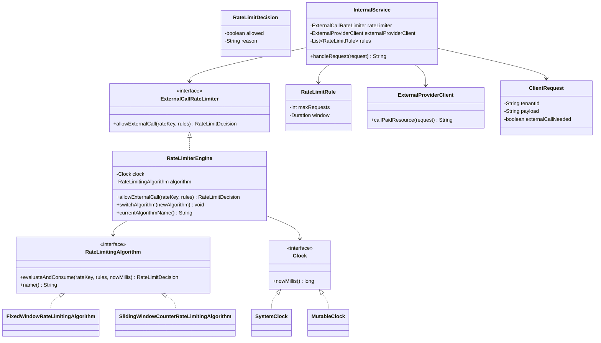

# Pluggable Rate Limiting System for External Resource Usage

This module demonstrates a pluggable, thread-safe rate limiting design that is applied only when the system is about to call a paid external provider.

## Problem Focus

- Rate limiting is **not** applied at API ingress.
- Internal business logic executes first.
- Only if business logic decides to call external provider, rate limiter is consulted.

## Class Diagram



## Key Design Decisions

### 1. Strategy Pattern for Algorithm Pluggability

- **Extension Point:** `RateLimitingAlgorithm`
- **Switching:** `RateLimiterEngine.switchAlgorithm(...)` enables runtime algorithm changes
- **Isolation:** Business logic (`InternalService`) remains unaffected

### 2. Clean Separation of Concerns

- **`InternalService`:** Owns business flow
- **`RateLimiterEngine`:** Handles orchestration and rule validation
- **Algorithm classes:** Manage state and admission logic

### 3. Thread Safety

- Algorithms use concurrent maps for state storage
- **Per-rate-key lock** ensures atomic check-and-consume across multiple rules
- Prevents partial consumption when one rule passes but another fails

### 4. Multi-rule Support

Multiple limits can be enforced on the same key:
- `5 requests / minute`
- `1000 requests / hour`

A request is allowed only when **all** configured rules pass.

### 5. Testability

- **`Clock` abstraction** enables deterministic time simulation
- **`MutableClock`** allows controlled time progression in tests/demos

---

## Implemented Algorithms

### Fixed Window Counter

| Aspect | Details |
|---|---|
| **Mechanism** | Time partitioned into fixed buckets |
| **Reset** | Counter resets at bucket boundary |
| **Characteristics** | Fast and simple |

### Sliding Window Counter

| Aspect | Details |
|---|---|
| **Mechanism** | Tracks current and previous window counters |
| **Weighting** | Uses weighted previous window contribution for smoother limiting |
| **Characteristics** | Reduces boundary burstiness vs. fixed window |

---

## Trade-offs: Fixed Window vs Sliding Window

| Dimension | Fixed Window | Sliding Counter |
|---|---|---|
| **Accuracy** | Coarse near boundaries (can burst at edges) | Smoother, closer to true rolling window |
| **Complexity** | Simpler logic, easy to reason about | Moderately complex weighted estimation |
| **Memory** | `O(keys × rules)` | `O(keys × rules)` |
| **CPU** | Minimal arithmetic | Slightly more arithmetic per call |

---

## Adding New Algorithms

To extend with a new algorithm (e.g., Token Bucket):

1. Create class implementing `RateLimitingAlgorithm`
2. Inject or switch in `RateLimiterEngine`
3. No changes needed in `InternalService`

---

## Example: Multi-Tenant Rate Limiting

**Scenario:** Tenant `T1` with multiple limits

Rate limits:
- `5 requests per minute`
- `1000 requests per hour`

**Request Flow in `InternalService.handleRequest(...)`:**

```
1. Run business logic
   ↓
2. Check if external call needed
   ├─ No  → Return (no quota consumed)
   └─ Yes → Continue
   ↓
3. Compute rate key (e.g., tenant:T1|provider:payments)
   ↓
4. Call rateLimiter.allowExternalCall(...)
   ├─ Allowed   → Call external provider
   └─ Rejected  → Return error gracefully
```

## Build

From module root (`pluggable-rate-limiter`):

```bash
javac src/com/example/ratelimiter/*.java
```

## Run

```bash
java -cp src com.example.ratelimiter.App
```
